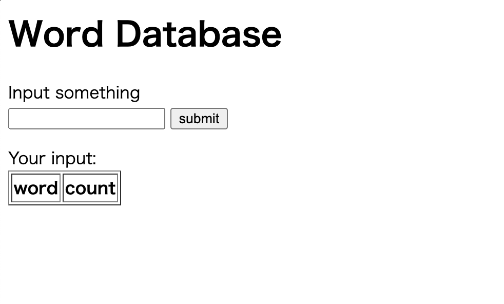
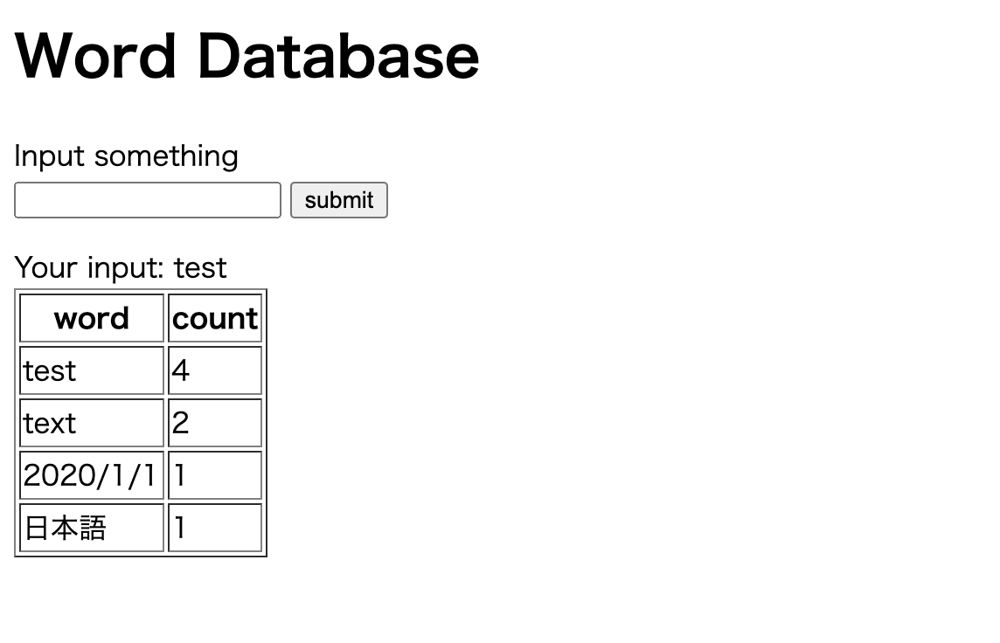

# application-modernization-example

This is an example of application modrnization for learning.

## Overview

To explain application modernization, I created a simple word database application.

This application saves the input character string and the number of times in the database and display on the web.

## Contents

In this repository, a "Word Database" is made using following technology.

### Step 1

Linux + Apache + MySQL + PHP

### Step 2

Golang + MySQL

### Step 2.5

GAE(Golang) + Cloud SQL

### Step 3

App on Docker

### Step 4

App with better architecture