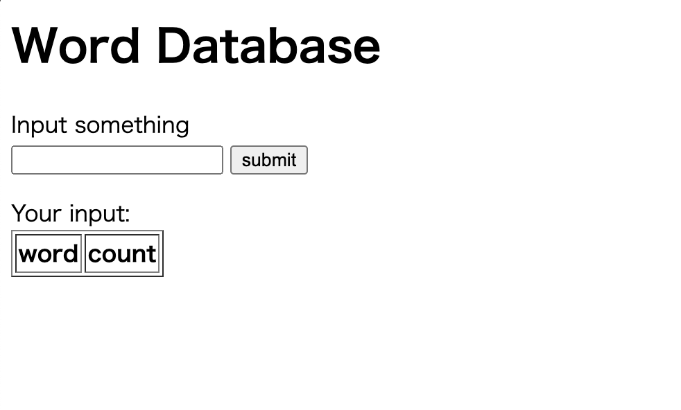
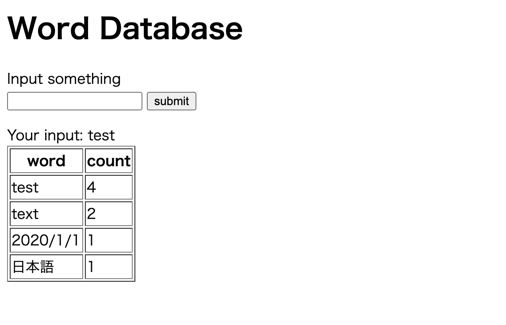

# Step 0: Simple word database application

This is a simple word database application using LAMP stack.

This application saves the input character string and the number of times in the database and display on the web.




## Environment

- OS : Ubuntu 20.04 LTS on GCP
- Web server : Apache v2.4.41
- PHP : 7.4.3
- MySQL : 8.0.20

## Install

```bash
sudo apt update
sudo apt install tasksel
sudo tasksel install lamp-server
git clone https://github.com/sleek629/application-modernization-example.git
cd application-modernization-example/step0/src
sudo mv index.php /var/www/html/
sudo rm /var/www/html/index.html
sudo mysql -u root < init.sql
```

